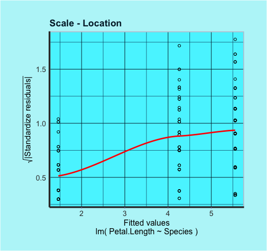

```{r setup, include = FALSE}
knitr::opts_chunk$set(
  collapse = TRUE,
  comment = "#>"
)
```

# To install:

```{r , eval=FALSE}
devtools::install_github("stasinak/AdvPro4")
```

$~$

# How to Use:

First, you have to create an object.

```{r }
library(Linear.reg)
data(iris)
linreg_mod <- linreg$new(formula = Petal.Length~Species, data = iris)
linreg_mod$print()
```


***
#Use the Linear Regression Model and the Functions
The object contains a linear regression fit based on the `formula` and on the `data` the user provides.The model automatically calculates the Regressions Coefficients,the fitted values,the residuals,the degrees of freedom,the residual variance,the variance of the regression coefficients,the t-values for each coefficient.

After the object is created, the user can use the methods linreg.print(),linreg.plot(),linreg.resid(),linreg.pred(),linreg.coef(),linreg.summary().

#print
The print method prints the coefficients and coefficient names.

```{r }
linreg_mod$print()


```
#plot

The plot method returns two plots.One plot with Residuals vs Fitted Values and the other one the Square of Standartized residuals vs Fitted values. 
 </img>

#Resid Method

resid method returns the vector of residuals e.
```{r}
linreg_mod$resid()

```

#Pred Method
Pred method  returns the predicted values yˆ.
```{r }

linreg_mod$pred()

```


#Coef Method
Coef method  returns the coefficients as a named vector

```{r }
linreg_mod$coef()

```


#Summary method
Summary returns the coefficients with their standard error, t-value and p-value as well as the estimate of ˆσ and the degrees
of freedom in the model.

```{r }
linreg_mod$summary()

```


